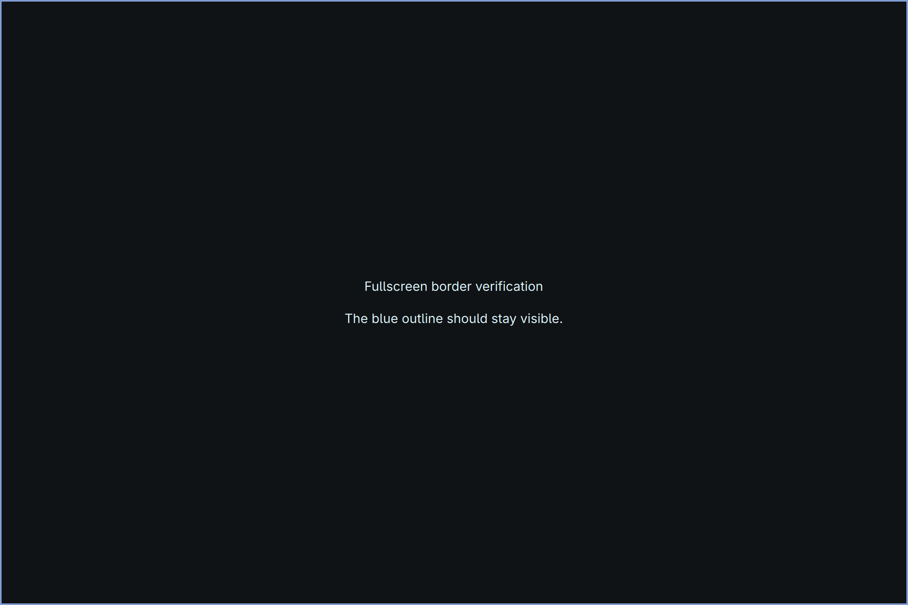

# Fullscreen Border

Know when one big window is hiding the rest of your workspace.

Fullscreen Border gives maximized and fullscreen windows a persistent outline
in a secondary color from your Omarchy theme. Normal active and unfocused
windows keep their usual borders. The screensaver stays borderless.



## What it does

- Uses a 3-pixel border in both maximized and true fullscreen modes.
- Selects a theme color distinct from both ordinary border colors, including
  gradient stops. It checks contrast against the theme background.
- Recalculates the color when Omarchy applies a theme.
- Hides the overlay for the Omarchy screensaver and an open special workspace.
- Leaves keyboard focus and mouse input with your application.
- Supports Yoohoo attention pulses on maximized windows, in the same color family.

For example, the stock Hackerman palette produces blue, Catppuccin pink,
and Nord yellow. These are automatically selected, not per-theme overrides.

## Requirements

Omarchy 4 with its Quickshell shell and Lua-based Hyprland configuration.
Developed on Omarchy 4.0.3 / Hyprland 0.56.2. Setup requires Python 3 and the
standard `omarchy`, `omarchy-shell`, and `hyprctl` commands.

This does not target older Waybar-based Omarchy releases or non-Omarchy desktops.
No extra daemon or root permissions are needed.

## Install from a repository

```sh
omarchy plugin add https://github.com/gdiab/omarchy-fullscreen-border
python3 ~/.config/omarchy/plugins/gdiab.fullscreen-border/configure.py install
```

If the plugin manager asks whether to enable it, setup will handle enablement.
The second command is necessary: Omarchy deliberately does not execute setup
hooks supplied by a plugin.

Setup backs up `~/.config/hypr/hyprland.lua` and appends a small, marked block.
The block loads the package's native maximized-border rules after your existing
rules. Setup checks the configuration, restores it if installation fails, and
enables the fullscreen overlay. Running setup again is safe.

## Install from the archive

Download `fullscreen-border-1.1.0.tar.gz` from the
[latest release](https://github.com/gdiab/omarchy-fullscreen-border/releases/latest)
and extract it into `~/.config/omarchy/plugins/`.
The archive contains a top-level `gdiab.fullscreen-border` folder. First check
that this folder does not already exist; do not overwrite another installation.
Then run the same `configure.py install` command above.

## Use and verify

There is no new shortcut to learn:

| Window mode | Omarchy default shortcut | Border |
| --- | --- | --- |
| Normal tiled/floating | Return from fullscreen | Normal theme colors |
| Maximized / full-width | Super + Alt + F | Distinct theme color |
| True fullscreen | Super + F | Same color around screen edges |
| App fullscreen inside a tile | Super + Ctrl + F | Normal theme colors |
| Omarchy screensaver | Automatic | No added outline |

Try a theme from **Super + Ctrl + Shift + Space**, then maximize a window.
Read the selected color and monitors currently showing the fullscreen overlay:

```sh
omarchy-shell gdiab.fullscreen-border state
```

`monitors: []` is normal when no true-fullscreen app is visible. Maximized
windows use native borders and do not appear in that list.

## Update

For a Git-managed installation:

```sh
omarchy plugin update gdiab.fullscreen-border
python3 ~/.config/omarchy/plugins/gdiab.fullscreen-border/configure.py install
```

Some Omarchy/Qt versions retain old QML after plugin reloads. If an update is
not reflected, run `omarchy restart shell` while unlocked. This briefly restarts
the bar and shell overlays. Setup does not restart the shell automatically.

## Remove

First detach the native rules and disable the overlay:

```sh
python3 ~/.config/omarchy/plugins/gdiab.fullscreen-border/configure.py remove
omarchy plugin remove gdiab.fullscreen-border
```

Removal preserves the rest of your configuration and does not delete backups.
Only disabling the plugin through the plugin menu disables the fullscreen
overlay; use `configure.py remove` to disable both modes.

If the plugin folder was already deleted, its marked Lua block safely skips
the missing file. Remove that block manually and run `hyprctl reload`.
The generated `~/.local/state/omarchy/fullscreen-border.json` and setup backups
under `~/.local/state/omarchy/fullscreen-border-backups/` can be removed afterward.

## Limits and compatibility

- True fullscreen has no native border, so a transparent overlay covers the
  outermost 3 **logical pixels** of the app. It also appears over fullscreen
  video and games; this can prevent direct scanout while visible.
- Monochrome or unusual palettes may need a contrasting fallback color rather
  than a color directly from the theme. RGB separation is a heuristic, not a
  guarantee of distinguishability for every kind of color vision.
- It reacts to compositor events; it does not continuously poll.
- Detection is per monitor. Live verification has covered one physical display;
  multi-monitor behavior is not yet hardware-tested.
- Other overlays can stack above the outline. It does not draw over the lock.
- Custom border rules loaded after the managed block can override native colors.
- The optional Yoohoo tag rules do nothing when Yoohoo is not installed.

An older hand-installed `require("hypr.fullscreen-border")` must be removed
before using setup, otherwise the native rules would load twice. Keep your
old file as a backup until migration is verified.

## Development and verification

```sh
omarchy plugin validate .
python3 -m unittest discover -s tests -v
node tests/window-selection.test.cjs
lua tests/palette.test.lua
```

Tests use temporary files and fake desktop commands; they do not modify your
desktop or launch the screensaver. The runtime code was visually checked in
normal, maximized, fullscreen and actual-screensaver states before packaging.
The setup/removal path is tested in isolation; this package has not yet been
installed on a second machine. See [CHANGELOG.md](CHANGELOG.md).

MIT licensed. No network calls, telemetry, title logging, or background daemon.
